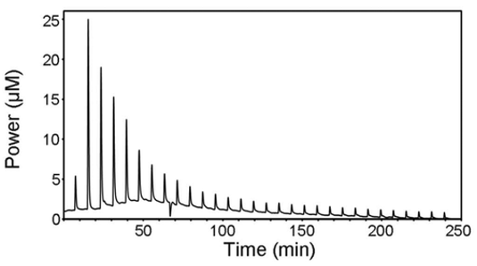
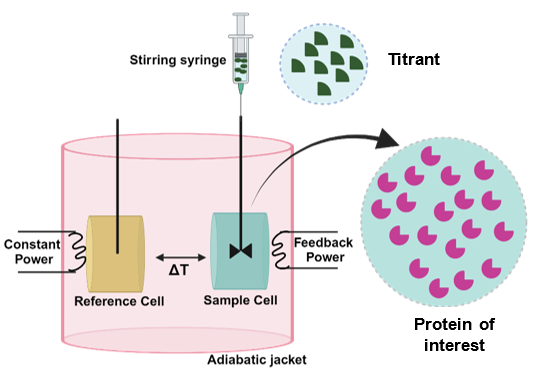

## Objective

Isothermal titration calorimetry (ITC) is one of the very important techniques used to determine the label-free specific interactions between molecules dissolved in the aqueous solution such as protein-ligand binding, protein-protein binding, DNA-protein binding, protein-carbohydrate binding, protein-lipid binding and antigen-antibody interaction. It is a highly sensitive technique that works by titrating one binding reagent titrant, generally a small chemical compound called a ligand into a titrand, usually protein at a constant temperature. This technique is commonly used for drug development as it provides valuable thermodynamic information about the interaction of the molecule with its target protein. ITC can precisely determine Gibbs energy, enthalpy, entropy, and heat capacity changes associated with the binding or interaction of biomolecules.

## Theory

The ITC instrument measures the amount of power (µcal/sec) required to maintain a constant temperature difference (close to zero) between the sample and the reference cell. Initially, the feedback system continuously applies a small power to the sample cell, which determines the baseline level. Each injection of the syringe solution (usually termed as a ligand) triggers the binding reaction and, depending on the binding affinity and the concentration of reactants (macromolecule, M, and ligand, L) in the cell, a certain amount of macromolecule/ligand (ML) complex is formed. The formation of the complex is accompanied by the release (exothermic reaction) or the absorption (endothermic reaction) of heat that causes a difference in temperature between the two cells. Then, the feedback system either lowers or raises the thermal power applied to compensate for such temperature unbalance. After each injection, the system reaches equilibrium and the temperature balance is restored. Therefore, the recorded signal shows a typical deflection pattern in the form of a peak (Fig. 1). Integrating the area under the peak, assuming the baseline as a reference, provides the amount of heat associated with the injection. As the reactant in the cell becomes saturated, the heat signal diminishes until only the background heat.
In a properly designed, typical ITC experiment, the binding affinity (dissociation constant, Kd or binding constant, Kb (= 1/ Kd)), stoichiometry (n), and the enthalpy (∆H) at a constant temperature (T) are measured. From these data, the Gibbs energy change (∆G) and entropy change (∆S) may be calculated. If one protein molecule (M) binds one ligand (L), then the 1:1-binding model is applied.

Figure 1

**Instrumentation:**
Two identical coin-shaped cells, sample and reference, are enclosed in an adiabatic shield (jacket) as illustrated in (Fig. 2). The temperature difference between the reference cell and the jacket is continuously monitored to maintain a constant temperature. A feedback control system monitors the difference in temperature between the two cells through a semiconductor Peltier sensor device sandwiched between them. This temperature difference is kept constant and as close to zero as possible. The feedback signal is the measured signal.
One of the reactants is placed in the sample cell and the other one in the injection syringe. During an experiment, the syringe is used to add the titrant reactant to the sample cell in a stepwise fashion and, at the same time, stir the solution in the sample cell to achieve fast mixing. The reference cell serves only as a temperature reference

Figure 2

