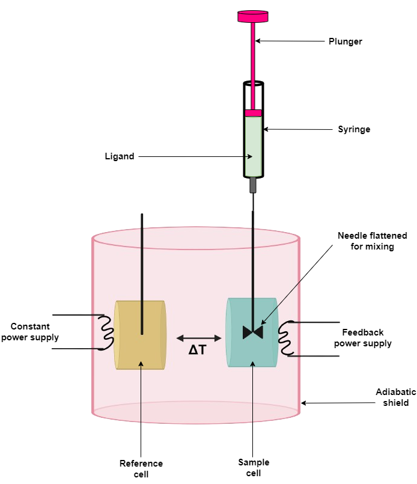

## Procedure

### Materials Required
- Isothermal titration calorimeter. 
- Data analysis software. 
- Hamilton syringe. For the sample cell loading.
- Test tubes, Pipettes and Pipette Tips. For sample preparation.
- Vacuum pump. To degas the samples.
- pH meter. To determine the pH of solutions.

### Sample Preparation: Concentration
To obtain a sigmoidal isotherm (1:1 model), the molar ratio of titrant to titrand should be equal to 2 at the end of the titration. The solution in the syringe should be approximately 10-fold more concentrated than in the cell. Some macromolecules are poorly soluble and aggregate at higher concentrations. For this reason, most often the solution of protein is loaded into the sample cell. The optimal macromolecule concentration is determined from the Wiseman parameter (also called the sigmoidal factor or c value)  
c = Kb  x [M] x n  

where  Kb - binding constant, [M] - concentration of the protein (macromolecule), n - stoichiometric coefficient (or could mean the purity of the protein preparation).
Optimal values range from approximately 5 to 500.

### Buffers
Buffers of both low and high enthalpy of protonation should be prepared. Phosphate has low protonation enthalpy while TRIS has high protonation enthalpy. Typically prepare 10-50 mM buffer, 100 mM salt, usually but not always NaCl (e.g. sodium phosphate buffer (50 mM NaPi, 100 mM NaCl), pH 7.0). For intrinsic parameters the reaction should be performed in as wide pH range as possible, usually pH 5.0-9.0. Always consider the pKa of the buffer while using it for ITC experiment.

### Composition
Both the cell and syringe samples must be in as closely matched solutions as possible. Differences in composition cause large heats of dilution and mask the desired observation. Solvent matching is best achieved when the macromolecule solution is dialyzed exhaustively against the buffer and then using the final dialysis buffer to make up the ligand solution in the syringe. 

There are some special cases of sample preparation. For example, some small molecules may need organic solvents (e.g. DMSO) to be soluble or proteins may need reductants to maintain reduced cysteines. It is important to add the same concentrations of each additive to both solutions, considering stability (many proteins are stable up to 2 - 5% of DMSO).    

 Centrifuge the solutions to eliminate possible precipitates. Degas prepared samples to avoid spikes caused by bubbles of air released from the solution during titration. Centrifugation also helps remove bubbles

### Experimental Parameters
It may take several titrations to optimize the conditions that are the best for the system.

***Number of injections and injection volumes:*** For systems that have strong heat signals - a large number (e.g. 50) of low volume (1 μl) injections. For binding systems with weak heat signals - a small number (e.g. 20) of large volume (10 μl) injections. The volumes depend on the equipment.

***Timing (the time spacing between each injection):*** After each injection of titrant, the system is given time to return the heat signal to baseline before the next injection occurs. For most systems, a five-minute spacing should be adequate. Shorter times may be used if demonstrated that the enthalpy is not diminished.

***The temperature of the experiment:*** 25 ºC being the most common. However, the operating temperature range from 2 to 80 ºC is possible.

***The stirring speed of the syringe:*** Stirring is necessary for adequate mixing, but should be set at a relatively low rate, because some macromolecules may be denatured by stirring.

### Steps
1.	The reference cell must be filled with distilled water or buffer. Usually, distilled water can be used as the reference solution. However, it is not entirely correct to compare distilled water to buffers with high ionic strengths. In this case, it is better to use the buffer as a reference solution.
2.	Make sure the sample cell and injection syringe are cleaned according to the manufacturer's protocol.
3.	Rinse the sample cell several times with buffer or sample solution. 
4.	Load the sample cell with the solution slowly to avoid bubble formation. The volume should be greater than the active volume of the cell. Remove any excess volume from the sample cell if overfilled the stem during loading.
5.	Rinse the injection syringe with a buffer or titrant solution. 
6.	Fill the syringe with solution being careful to avoid bubble formation.
7.	Place the injection syringe into the sample cell.
8.	Run the experiment.
9.	Run a control experiment, where the ligand is titrated into the buffer in the sample cell to determine the heat of dilution for the ligand.

### Data analysis
1.	Adjust the baseline to eliminate the effect of the baseline.
2.	Integrate the peaks
3.	Subtract the blank experiment to correct for the heat of dilution. The last points of the sigmoid curve (the enthalpy at saturation) should be approximated to zero.

## Simulation instrument setup

